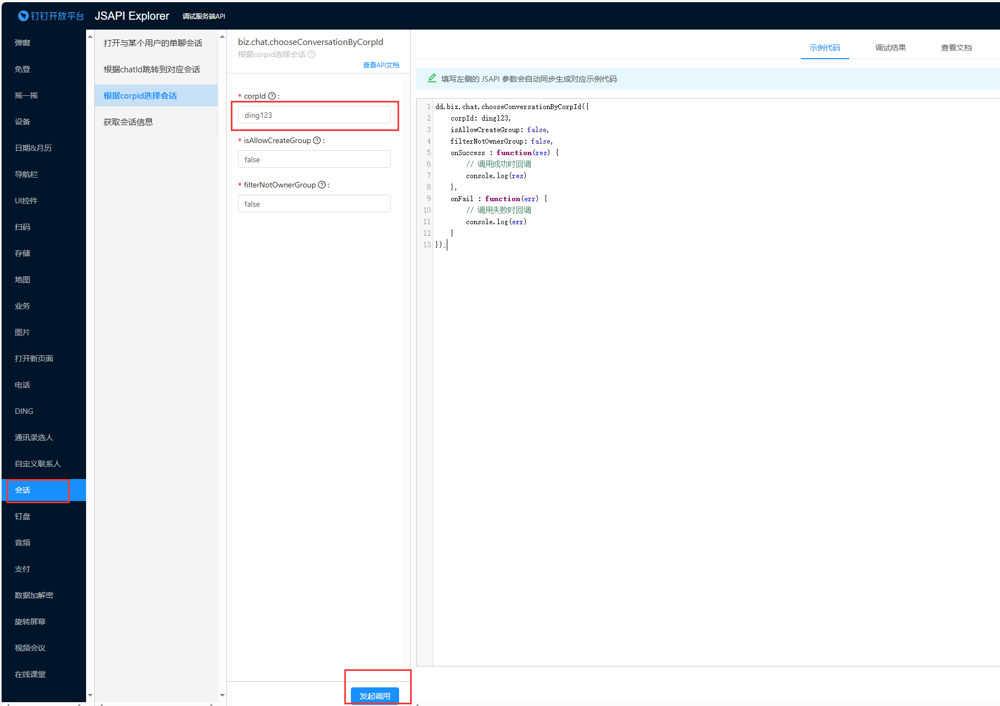
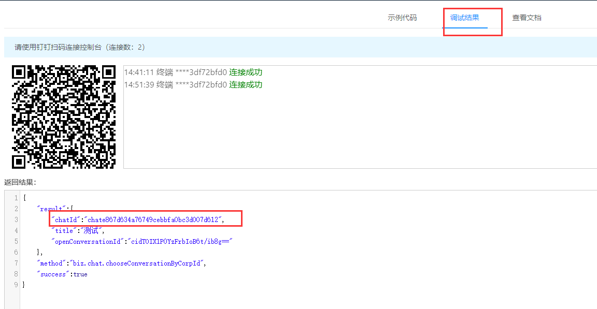

# Find DingTalk-Group ID

!!! debug
    前提：本人需要在指定的群方可调试

1. 打开客户端调试地址 [JSAPI Explorer](https://open-dev.dingtalk.com/apiExplorer#/jsapi?api=biz.chat.chooseConversationByCorpId)

2. 填写企业id（corpId）的值，然后点击下面的"发起调用"

3. 然后它会让你用钉钉扫码，扫码之后，在钉钉上你可以看到自己所在的钉钉群，点击想看的群就可以看到群id（chatId）

