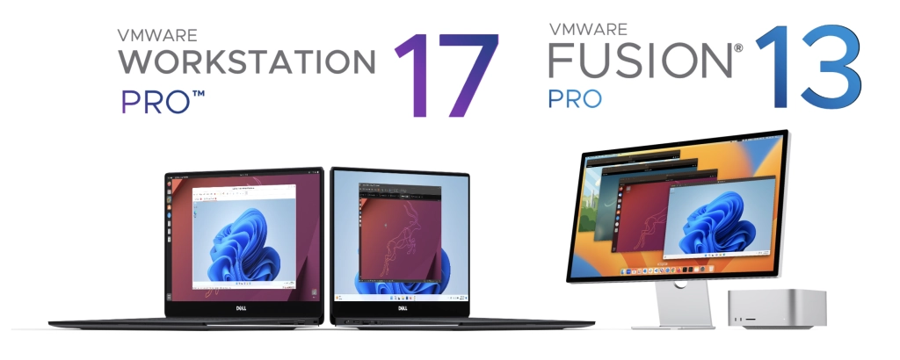
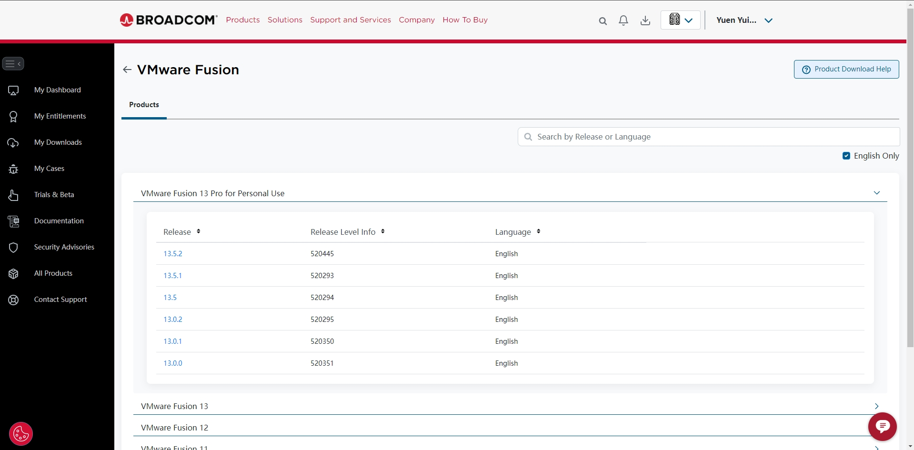

!!! info "VMware 虚拟机正式对个人免费，最新 Pro 免激活（支技 Win/Mac）"

    VMWare Workstation / Fusion 

    - [x] VMware Fusion Pro - Mac
    - [x] VMware Workstation Pro - Win

博通于 2023 年 11 月完成了 690 亿美元对云计算公司 VMware 的收购，合并后的 VMware 宣布云服务全面取消“永久许可证”并改为订阅制，引起用户不满。

除此之外，VMware 现在又做出了一个小小的但很有诚意的让步：Workstation Pro 和 Fusion Pro 产品现在起将免费供个人用户使用。

VMware Workstation Pro 可供 Windows 或 Linux 用户使用，而 Fusion Pro 可供基于 Intel CPU 或 Apple M 系列处理器的 Mac 电脑使用。

VMware 的 Pro 应用将提供两种许可模式：“免费个人使用”以及针对企业和组织的“付费商用订阅”。用户可以自行决定是否订阅，而且 VMware 也强调这两个版本之间没有功能差异，唯一的可视性差异是免费版本会显示“此产品仅供个人使用”提醒。

### 如何下载

> 用户只需前往 [Broadcom](https://profile.broadcom.com/web/registration) 注册一个博通账号即可免费下载并使用 VMware 软件，另外下载时务必选择 For Personal User 版本

VMWare Workstation / Fusion Pro 虚拟机下载地址如下：

- [MacOS - VMware Fusion Pro](https://support.broadcom.com/group/ecx/productdownloads?subfamily=VMware+Fusion)
- [Windos - VMware Workstation Pro](https://support.broadcom.com/group/ecx/productdownloads?subfamily=VMware+Workstation+Pro)

访问下载地址后，就可以看到一个列表页，其中 For Personal User 就是个人用户免费版本，点击最新版本进入详情页进行下载（注意勾选同意协议）

最后还会让补充地址、省份、邮编等信息，随意使用地址生成器填写即可

### 如何安装

安装过程在此略过，仅安装时勾选「我希望授予将 VMWare Workstation / Fusion 用于个人用途的许可」这个选项，然后点击继续就大功告成。

**参考资料**

- [VMware 虚拟机个人免费：Fusion Pro 及 Workstation Pro 即日起可用](https://www.ithome.com/0/767/979.htm)
- [重磅！VMware 虚拟机正式对个人免费 - 最新 Pro 免激活/网盘下载 (支持 Win / Mac)](https://www.iplaysoft.com/vwmare-free.html)

